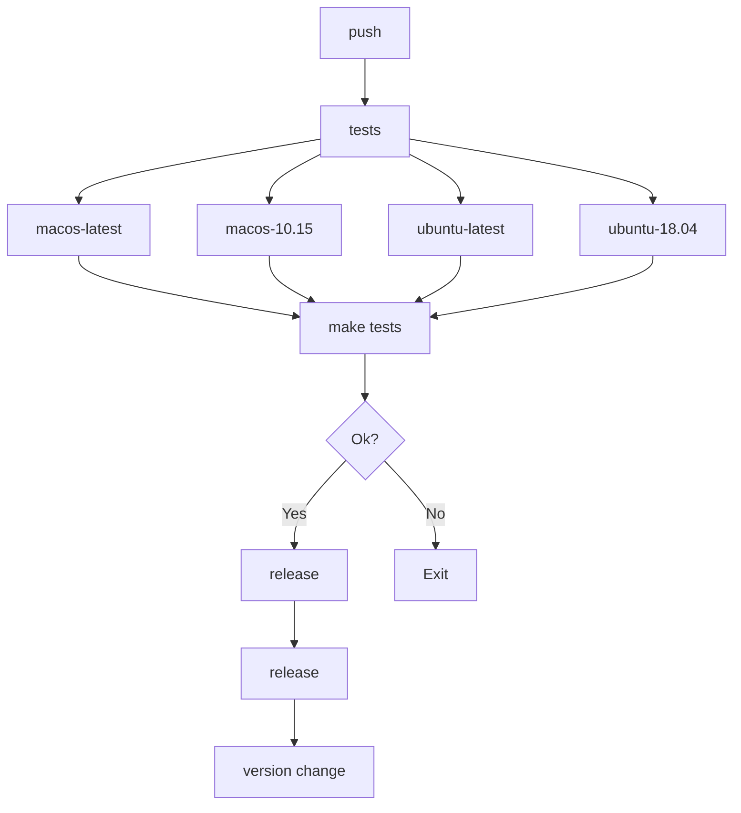

# [mreleaser](https://github.com/j5pu/mreleaser)


[](https://github.com/j5pu/mreleaser/actions/workflows/main.yaml)
[](https://github.com/j5pu/homebrew-tap/actions)
Multi Language Releaser Action and Scripts

## [action](./action.yml)

### Examples:

```yaml
name: main

on:
  push:
  release:
  workflow_dispatch:

env:
  GITHUB_TOKEN: ${{ secrets.GH_TOKEN }}

jobs:
  tests:
    runs-on: ${{ matrix.os }}
    strategy:
      fail-fast: true
      matrix:
        os: [ macos-latest, macos-10.15, ubuntu-latest, ubuntu-18.04 ]
    steps:
      - uses: actions/checkout@main
      - uses: Homebrew/actions/setup-homebrew@master
        if: runner.os == 'macOS'
      - run: make tests

  release:
    needs: [ tests ]
    runs-on: ubuntu-latest
    steps:
      - uses: actions/checkout@main
        with:
          fetch-depth: 0
          token: "${{ env.GITHUB_TOKEN }}"
      - id: release
        uses: j5pu/mreleaser@main
```

[mermaid-graph](https://waylonwalker.com/til/github-supports-mermaid//)
[mermaid-flowchart](https://github.blog/2022-02-14-include-diagrams-markdown-files-mermaid/)
[mermaid](https://mermaid-js.github.io/mermaid/#/)



## [bats.bash](./bin/bats.bash)

Bats helpers

### Install

````shell
brew install j5pu/tap/shrc
bats.bash --help
````

### JetBrains


### [.env](.env)

```shell
# shellcheck disable=SC2034

BATS_BASH=$PROJECT_BATS_BASH$
BATS_NUMBER_OF_PARALLEL_JOBS=600
PATH="${BATS_BASH}/bin:${PATH}"
```

### [.envrc](.envrc)

````shell
BATS_BASH="$( cd "$(dirname "${BASH_SOURCE:-$0}")"; pwd -P )"; export BATS_BASH
eval "$(awk 'FNR > 1 { print "export " $0 }' "${BATS_BASH}/.env" | grep -v "^$" | sed 's/^/export /g')"

````

### [tests_helper.bats](tests/helpers/helper.bash)

```shell
source bats.bats
```

### [test.bats](tests/bats.bash/func::exported.bats)

````shell
#!/usr/bin/env bats

setup_file() {
  load helpers/tests_helper
}
````
