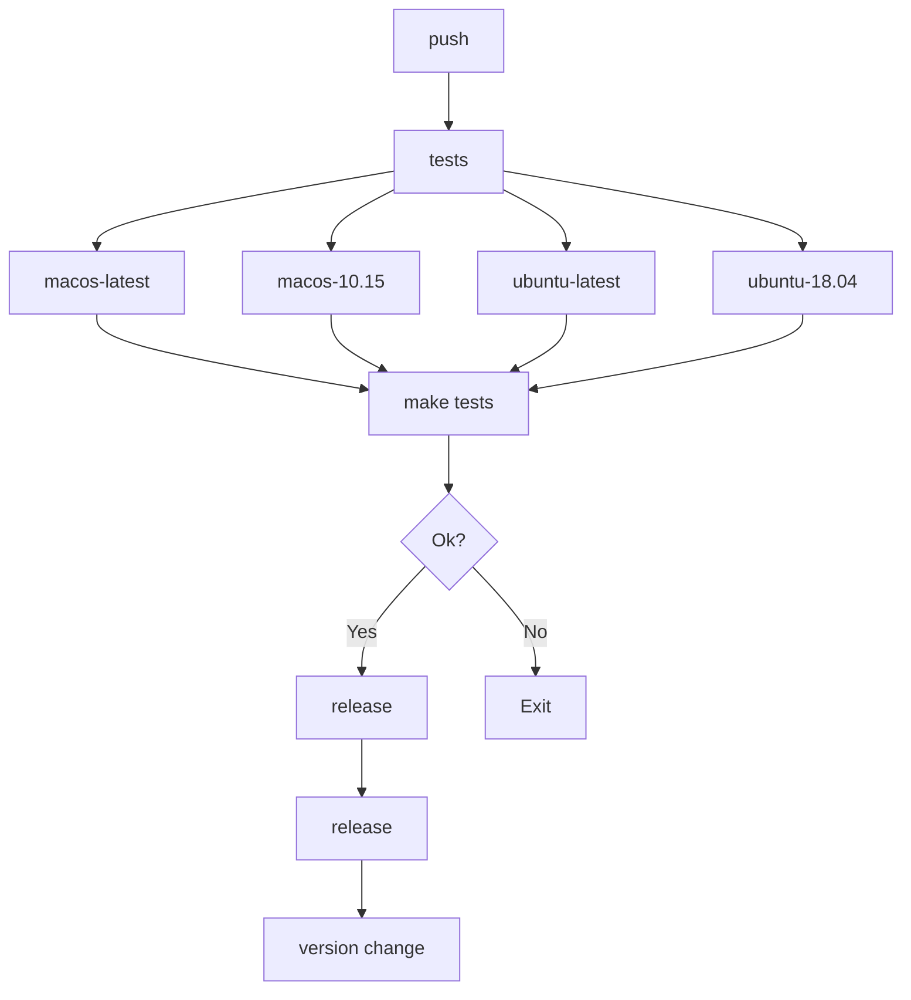

# [mreleaser](https://github.com/j5pu/mreleaser)


[](https://github.com/j5pu/mreleaser/actions/workflows/main.yaml)

[](https://github.com/j5pu/homebrew-tap/actions)

Multi Language Releaser Action and Scripts

## [action](./action.yml)

### Examples:

```yaml
name: main

on:
  push:
  release:
  workflow_dispatch:

env:
  GITHUB_TOKEN: ${{ secrets.GH_TOKEN }}

jobs:
  tests:
    runs-on: ${{ matrix.os }}
    strategy:
      fail-fast: true
      matrix:
        os: [ macos-latest, macos-10.15, ubuntu-latest, ubuntu-18.04 ]
    steps:
      - uses: actions/checkout@main
      - uses: Homebrew/actions/setup-homebrew@master
      - run: make tests

  release:
    needs: [ tests ]
    runs-on: ubuntu-latest
    steps:
      - uses: j5pu/mReleaser@main
```



## [bats.bash](./bin/bats.bash)

Bats helpers

### Install

````shell
brew install j5pu/tap/shrc
````
